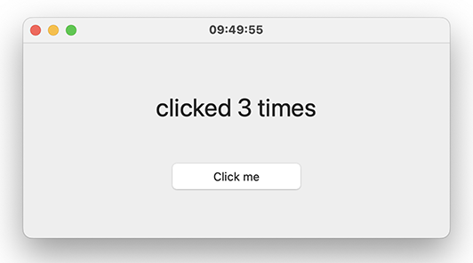

# GUI::Wings

Windows with wings: a native GUI framework for Raku. Declarative builders for
windows and widgets, every event a `Supply`, `react`/`whenever` as the event
loop.

## Synopsis

```raku
use GUI::Wings;

app 'Counter', {
    my $n = 0;
    window :title('Camelia counts'), :size(480, 220), {
        my $l = label 'clicked 0 times', :font(28);
        my $b = button 'Click me';

        react {
            whenever $b.clicks        { $l.text = "clicked {++$n} times" }
            whenever Supply.interval(1) { window.title = DateTime.now.hh-mm-ss }
            whenever signal(SIGINT)   { done }
        }
    }
}
```

## Status

**v0.1.0, a proof of concept.**

Three backends:

* **Cocoa** on macOS
* **Gtk** on Linux
* **Win32** on Windows

All three backends are behind a single API. 

Supported widgets:

* `window`
* `label`
* `button`

The module splits into a toolkit-free front `GUI::Wings` and backends behind
ten methods: `GUI::Wings::Backend::Cocoa`, `::Gtk`, `::Win32`. `WINGS_BACKEND`
picks one of them explicitly.

## Examples

### `examples/counter.raku` — a button that counts its clicks

The code shown above in the Synopsis section. 



### `examples/calculator.raku` — a four-function desk calculator

Its arithmetic is exact `Rat`s behind a rounded display, so
`1 ÷ 3 × 3` is exactly `1`, which is more than most desk calculators manage.

One program, three backends, no conditionals in it:

| macOS — Cocoa | Ubuntu — Gtk | Windows 10 — Win32 |
|---|---|---|
|  |  |  |

Each takes its look from the toolkit it is standing on: rounded keys and a
system orange on macOS, GTK's flatter ones on Ubuntu, and on Windows the
digits are ordinary push buttons while the tinted keys are painted by the
backend, bevel and all, because Win32 has no coloured button to ask for.

### Running them

Both examples take the same command; swap in `calculator.raku` for the other.

| | |
|---|---|
| macOS, Raku++ | `RAKUPP_MAIN_THREAD=1 rakupp -I lib examples/counter.raku` |
| macOS or Linux, Rakudo | `raku -I lib examples/counter.raku` |
| Windows, Raku++ | `rakupp -I lib examples\counter.raku` |

### Test options

- `WINGS_AUTODRIVE=n` — clicks every button once a second, n times, then ends
  the app through its own exit path (SIGINT where there is one; on Windows, by
  closing every window). The whole GUI proves itself in about n+1 seconds,
  which is how the examples are checked on a machine nobody is sitting at.
- `WINGS_DEBUG=1` — narrates on stderr: the backend it picked, each window
  going up, and every title and label the pump reconciles.
- `WINGS_BACKEND=Cocoa|Gtk|Win32` — overrides the choice made from the OS, so
  the GTK backend can be run on a Mac with GTK installed.

## Requirements

- **macOS 10.12.2 or newer** (10.12 if you drop `:tint`). The floor comes from
  Apple's availability annotations — `labelWithString:` and
  `buttonWithTitle:target:action:` are 10.12, the monospaced-digit font 10.11,
  `setBezelColor:` and the `system*Color` family 10.12.2 — and everything else
  Wings touches is decades older. Tested on macOS 15.7.
- **Intel and Apple Silicon** both, same module file; the alignment enum is the
  one arch difference and is picked at runtime.
- **Backends**: `GUI::Wings::Backend::Cocoa` (AppKit) is the macOS default —
  the only one needing `RAKUPP_MAIN_THREAD=1`, since AppKit alone insists on
  the process FIRST thread. `::Gtk` (GTK3, `libgtk-3.so.0`) is the Linux
  default and needs no env var there: GTK only requires that ONE thread makes
  all its calls, which the pump guarantees. A **macOS** GTK build is Quartz
  underneath, so AppKit's first-thread rule applies to it as well — under
  Raku++ that means `RAKUPP_MAIN_THREAD=1`, the same as for Cocoa. `::Win32` (user32/gdi32, wide APIs
  throughout so `÷ × −` survive) is the Windows default; Win32 is thread-
  affine like Cocoa but has no first-thread rule, so it needs no env var
  either.
- **Engines**: Rakudo works as-is on all three platforms. Raku++ needs
  `RAKUPP_MAIN_THREAD=1` for Cocoa, and a build newer than `v3.26.0` for
  Win32 — earlier ones cannot drive the Windows API at all
  ([Compatibility](#compatibility)).
- **Windows without libffi**: Raku++ then calls through a fixed prototype
  rather than libffi, which the Win32 backend needs to be wide enough for
  `CreateWindowExW`'s twelve arguments. Builds newer than `v3.26.0` are;
  `init` says so plainly if it is not, and either a newer engine or
  `set RAKUPP_FFI=C:\path\to\libffi-8.dll` (GTK, MSYS2 and Python each ship
  one) settles it. Rakudo has no such limit.
- **`signal(SIGINT)` on Windows** does not fire, so an app there ends by its
  window closing rather than by Ctrl+C; `WINGS_AUTODRIVE` closes the windows
  for the same reason.

## Scope

What v0.1.0 still leaves out: any widget beyond label and button, real layout
(children stack top-down and centred unless placed with `:at`), menus,
dialogs, images, and multiple apps per process. The three backends sit behind
the same ten methods; a terminal or DOM one would too, and neither exists.

## Compatibility

The `t/` suite is deliberately headless — the native declarations dlopen on
first call, so loading the module opens no window and the tests run on any OS.
The GUI itself is tested by the examples, which `WINGS_AUTODRIVE` drives to a
clean exit with no hands on the mouse.

| engine | version | `t/` | examples |
|---|---|---|---|
| Rakudo | `v2026.08` (MoarVM `2026.08`, Raku `v6.d`) | 8/8 | both self-drive to exit 0 |
| Raku++ | `v3.25.0` and newer; Win32 needs `v3.26.0-g03454ac` (`RAKUPP_MAIN_THREAD=1` on macOS) | 8/8 | both self-drive to exit 0 |

Backends, and the platform each is supported on:

| backend | platform | engine |
|---|---|---|
| Cocoa | macOS 15.7, arm64 and x86-64 | Raku++ (`RAKUPP_MAIN_THREAD=1`) and Rakudo |
| Gtk | GTK 3.24 — Ubuntu, and macOS against Homebrew GTK (Quartz) | Raku++ and Rakudo |
| Win32 | Windows 10 x64 | Raku++ and Rakudo |

Tested with Raku++ `v3.26.0-g03454ac` and Rakudo 2026.07/2026.08.

## Author

Andrew Shitov (`zef:ash`).

## Licence

Artistic-2.0.
