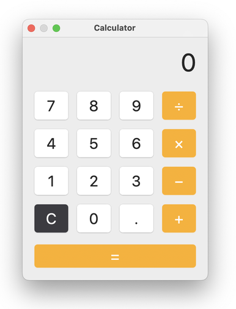
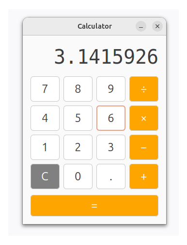
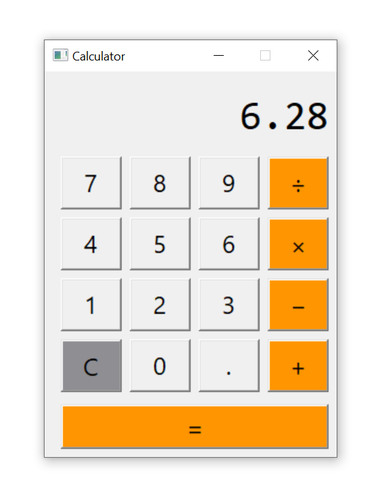

# GUI::Wings

Windows with wings: a native GUI framework for Raku. Declarative builders for
windows and widgets, every event a `Supply`, `react`/`whenever` as the event
loop. The Cocoa backend reaches AppKit through `objc_msgSend` over NativeCall —
no C glue, no bindings distribution to install.

> **Status: v0.1.0, a proof of concept.** Three backends — **Cocoa** on macOS,
> **Gtk** on Linux, **Win32** on Windows — behind one API, chosen from the OS
> and overridable with `WINGS_BACKEND=Cocoa|Gtk|Win32`. The widgets are
> `window`, `label` and `button`; see [Scope](#scope) for what that leaves out
> and [Requirements](#requirements) for the engine each backend needs.

```raku
use GUI::Wings;

app 'Counter', {
    my $n = 0;
    window :title('Camelia counts'), :size(480, 220), {
        my $l = label 'clicked 0 times', :font(28);
        my $b = button 'Click me';

        react {
            whenever $b.clicks        { $l.text = "clicked {++$n} times" }
            whenever Supply.interval(1) { window.title = DateTime.now.hh-mm-ss }
            whenever signal(SIGINT)   { done }
        }
    }
}
```

The module splits into a toolkit-free front (`GUI::Wings`) and backends behind
ten methods (`GUI::Wings::Backend::Cocoa`, `::Gtk`, `::Win32`); `WINGS_BACKEND`
picks one explicitly.

## Examples

Two of them, and the same two on every backend — which is the point of them.
Neither names a toolkit, an OS or a thread.

### `examples/counter.raku`

Fifteen lines, the ones above. A label, a button, and a `react` with three
sources: the button's clicks, a one-second `Supply.interval` retitling the
window, and `signal(SIGINT)`. It is the smallest program that uses the whole
machine — a builder marshalling to the thread that owns the toolkit, a widget's
Supply crossing back from it, and the pump reconciling changed state onto the
toolkit once a frame.

### `examples/calculator.raku`

Seventeen keys — digits, a decimal point, four operators, `C`, a full-width `=`
— feeding one `react`, with a big right-aligned monospaced readout and orange
operator keys. Its arithmetic is exact `Rat`s behind a rounded display, so
`1 ÷ 3 × 3` is exactly `1`, which is more than most desk calculators manage.
It is also the example that exercises the awkward parts: an explicit `:at` grid
rather than the auto-stack, per-widget fonts, non-ASCII key captions, and
tinted buttons — which on Win32 means owner-drawn ones, Windows having no
coloured push button of its own.

One program, three backends, no conditionals in it:

| macOS — Cocoa | Ubuntu — Gtk | Windows 11 — Win32 |
|---|---|---|
|  |  |  |

Each takes its look from the toolkit it is standing on: rounded keys and a
system orange on macOS, GTK's flatter ones on Ubuntu, and on Windows the
digits are ordinary push buttons while the tinted keys are painted by the
backend, bevel and all, because Win32 has no coloured button to ask for.

### Running them

Both examples take the same command; swap in `calculator.raku` for the other.

| | |
|---|---|
| macOS, Raku++ | `RAKUPP_MAIN_THREAD=1 rakupp -I lib examples/counter.raku` |
| macOS or Linux, Rakudo | `raku -I lib examples/counter.raku` |
| Windows, Raku++ | `rakupp -I lib examples\counter.raku` |

Close the window to quit. Ctrl+C does it wherever SIGINT exists, which is not
Windows — there the window's close box is the way out. Windows also wants a
Raku++ newer than 3.26.0; [Requirements](#requirements) says why.

### Without hands on the mouse

- `WINGS_AUTODRIVE=n` — clicks every button once a second, n times, then ends
  the app through its own exit path (SIGINT where there is one; on Windows, by
  closing every window). The whole GUI proves itself in about n+1 seconds,
  which is how the examples are checked on a machine nobody is sitting at.
- `WINGS_DEBUG=1` — narrates on stderr: the backend it picked, each window
  going up, and every title and label the pump reconciles.
- `WINGS_BACKEND=Cocoa|Gtk|Win32` — overrides the choice made from the OS, so
  the GTK backend can be run on a Mac with GTK installed.

## The model

- `app NAME, { ... }` gives one thread to the toolkit and pumps its event loop
  there; the block runs on a worker, so a `react` in it parks without freezing
  the GUI. On Cocoa that thread must be the process's first one, which is what
  `RAKUPP_MAIN_THREAD=1` arranges under Raku++.
- Builders — `window :title(...), :size(w, h), { ... }`, `label`, `button` —
  are plain subs. They marshal their toolkit work to the pump thread over a
  Channel and return live Raku objects. Inside a window block, `window` with
  no arguments is the current window.
- Events flow out as Supplies (`$button.clicks`); state flows in as plain
  attribute assignment (`$label.text = ...`, `window.title = ...`). Each pump
  turn *reconciles* changed state into the toolkit — no widget is touched from
  a worker thread.
- A click comes back the way each toolkit offers: a runtime-minted
  Objective-C class (`objc_allocateClassPair` + `class_addMethod`) whose action
  method is a Raku sub on Cocoa, a connected signal on GTK, `WM_COMMAND` in the
  window procedure on Win32 — each ending in `Supplier.emit`, and in your
  `whenever`.

## Requirements

- **macOS 10.12.2 or newer** (10.12 if you drop `:tint`). The floor comes from
  Apple's availability annotations — `labelWithString:` and
  `buttonWithTitle:target:action:` are 10.12, the monospaced-digit font 10.11,
  `setBezelColor:` and the `system*Color` family 10.12.2 — and everything else
  Wings touches is decades older. Tested on macOS 15.7.
- **Intel and Apple Silicon** both, same module file; the alignment enum is the
  one arch difference and is picked at runtime.
- **Backends**: `GUI::Wings::Backend::Cocoa` (AppKit) is the macOS default —
  the only one needing `RAKUPP_MAIN_THREAD=1`, since AppKit alone insists on
  the process FIRST thread. `::Gtk` (GTK3, `libgtk-3.so.0`) is the Linux
  default and needs no env var: GTK only requires that ONE thread makes all
  its calls, which the pump guarantees. `::Win32` (user32/gdi32, wide APIs
  throughout so `÷ × −` survive) is the Windows default; Win32 is thread-
  affine like Cocoa but has no first-thread rule, so it needs no env var
  either.
- **Engines**: Rakudo works as-is on all three platforms. Raku++ needs
  `RAKUPP_MAIN_THREAD=1` for Cocoa, and a build newer than `v3.26.0` for
  Win32 — earlier ones cannot drive the Windows API at all
  ([Compatibility](#compatibility)).
- **Windows without libffi**: Raku++ then calls through a fixed prototype
  rather than libffi, which the Win32 backend needs to be wide enough for
  `CreateWindowExW`'s twelve arguments. Builds newer than `v3.26.0` are;
  `init` says so plainly if it is not, and either a newer engine or
  `set RAKUPP_FFI=C:\path\to\libffi-8.dll` (GTK, MSYS2 and Python each ship
  one) settles it. Rakudo has no such limit.
- **`signal(SIGINT)` on Windows** does not fire, so an app there ends by its
  window closing rather than by Ctrl+C; `WINGS_AUTODRIVE` closes the windows
  for the same reason.

## Portability

Three backends, of which Cocoa is the one with an ABI to be careful about.
Both Mac ABIs are served by the same module: **no NSRect ever crosses the
FFI.** An NSPoint/NSSize is two doubles,
which arm64 (as an HFA) and x86-64 (as two SSE words) both pass exactly like
two `num64` arguments, so window geometry goes through `setStyleMask:` +
`setContentSize:` and widget geometry through `setFrameOrigin:` +
`setFrameSize:`. `objc_msgSend` is declared once per call shape via
`is symbol`; the runtime is loaded by absolute path, AppKit by explicit
`dlopen` (Rakudo rewrites extension-less framework paths).

Under Raku++ the interpreter runs programs on a big-stack worker thread, and
AppKit refuses windows off the main thread; `RAKUPP_MAIN_THREAD=1` runs the
program inline on the main thread instead. Under Rakudo the mainline already
is the main thread. `app` checks with `pthread_main_np` and says so if the
requirement is not met.

On **Windows** the module talks to `user32` and `gdi32` in wide APIs
throughout, so `÷ × −` survive as captions. Structures are laid out by hand as
byte buffers (`WNDCLASSEXW`, `MSG`, `DRAWITEMSTRUCT`) rather than as CStructs,
which keeps one layout for one ABI: x64. The window procedure is a Raku
callback, installed by subclassing each window with `SetWindowLongPtrW` —
a callable becomes a C function pointer only where a callback is declared, so
it cannot be written into the class structure directly. Tinted buttons and
labels are painted in `WM_DRAWITEM`, Win32 having no coloured push button and
no way to hand a STATIC the window's own face that survives the crossing.

The backend is chosen from `$*KERNEL.name` rather than `$*DISTRO.is-win`, which
Raku++ answers False on every host up to 3.26.

## Scope

What v0.1.0 still leaves out: any widget beyond label and button, real layout
(children stack top-down and centred unless placed with `:at`), menus,
dialogs, images, and multiple apps per process. The three backends sit behind
the same ten methods; a terminal or DOM one would too, and neither exists.

## Compatibility

The `t/` suite is deliberately headless — the native declarations dlopen on
first call, so loading the module opens no window and the tests run on any OS.
The GUI itself is tested by the examples, which `WINGS_AUTODRIVE` drives to a
clean exit with no hands on the mouse.

| engine | version | `t/` | examples |
|---|---|---|---|
| Rakudo | `v2026.08` (MoarVM `2026.08`, Raku `v6.d`) | 8/8 | both self-drive to exit 0 |
| Raku++ | built after `v3.26.0` (`RAKUPP_MAIN_THREAD=1` on macOS) | 8/8 | both self-drive to exit 0 |

Backends, and the platform each is supported on:

| backend | platform | engine |
|---|---|---|
| Cocoa | macOS 15.7, arm64 and x86-64 | Raku++ (`RAKUPP_MAIN_THREAD=1`) and Rakudo |
| Gtk | GTK 3.24 — Ubuntu, and macOS against Homebrew GTK | Rakudo |
| Win32 | Windows 11 x64 | Raku++ built after `v3.26.0` |

The Rakudo versions are ones it has been run on rather than floors; no older
release has been tried. The Raku++ floor for Win32 is a real one: `v3.26.0` and
earlier cannot run that backend, because the engine's platform identity and its
libffi-free FFI are not equal to the Windows API on those builds.

## Author

Andrew Shitov (`zef:ash`).

## Licence

Artistic-2.0.
